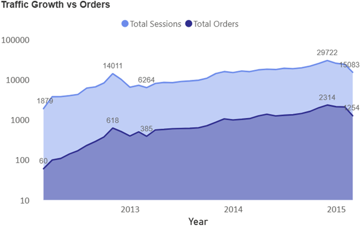
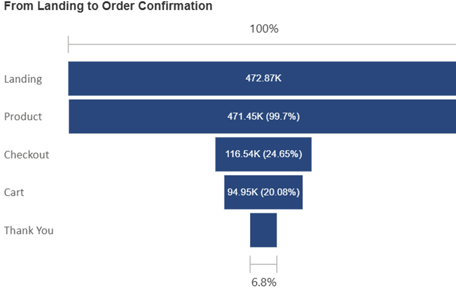
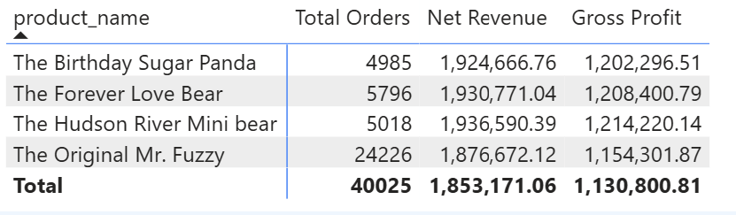
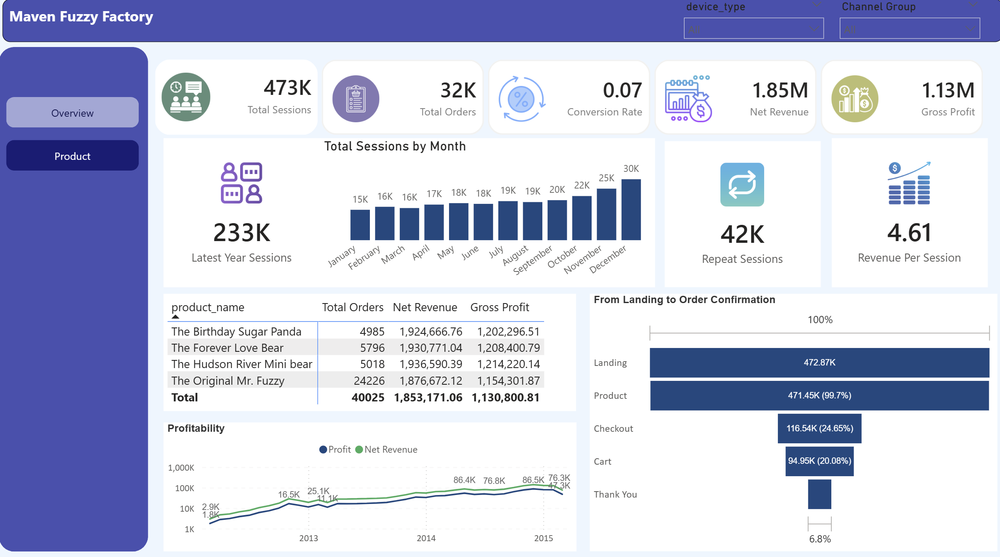

# 📊 Maven Fuzzy Factory – Business Performance Analysis

## 📑 Table of Contents

- [📌 Project Overview](#-project-overview)
- [🎯 Business Problem](#-business-problem)
- [🛠️ Tools & Technologies](#-tools--technologies)
- [📈 Traffic & Conversion Analysis](#-traffic--conversion-analysis)
- [📣 Marketing Channel Efficiency](#-marketing-channel-efficiency)
- [🔁 Funnel Analysis](#-funnel-analysis)
- [🧸 Product Performance](#-product-performance)
- [🔍 Key Insights](#-key-insights)
- [🚀 Business Recommendations](#-business-recommendations)
- [📌 Limitations](#-limitations)
- [🔮 Future Enhancements](#-future-enhancements)
- [📊 Executive Dashboard](#-executive-dashboard)

## 📌 Project Overview
This project analyzes the end-to-end business performance of Maven Fuzzy Factory, an e-commerce company specializing in teddy bears. The objective was to determine whether revenue growth was driven by efficient channel performance and optimized conversion or primarily by high-volume traffic with hidden inefficiencies.

---

## 🎯 Business Problem

> Is revenue growth driven by efficient channel performance and improved conversion, or overly dependent on traffic volume with underlying funnel inefficiencies?

---

## 🛠️ Tools & Technologies
- **Python (Pandas, Matplotlib)** – Data cleaning & exploration  
- **PostgreSQL** – KPI calculations & business logic analysis  
- **Power BI** – Interactive dashboard & visualization  

---

# 📈 Traffic & Conversion Analysis

Traffic scaled significantly over time, and orders followed a similar upward trend. Conversion rate improved from ~3% to over 8%, confirming that growth was supported by improved efficiency rather than volume alone.

---

# 📣 Marketing Channel Efficiency

| Channel       | Sessions | Orders | Revenue ($) | Conversion Rate | Revenue per Session |
|--------------|----------|--------|------------|-----------------|--------------------|
| Direct       | 83,328   | 6,118  | 371,433    | 7.34%           | $4.46              |
| Paid Search  | 378,858  | 25,852 | 1,544,817  | 6.82%           | $4.08              |
| Paid Social  | 10,685   | 343    | 22,259     | 3.21%           | $2.08              |

- Paid Search drives scale.
- Direct delivers highest efficiency.
- Paid Social underperforms and requires optimization.

---

# 🔁 Funnel Analysis

Only **6.8% of total visitors complete a purchase**, with major drop-offs between the product page and checkout stages. Funnel optimization presents the largest opportunity for revenue improvement without increasing traffic spend.

---

# 🧸 Product Performance

Although *The Original Mr. Fuzzy* drives the highest order volume, products such as *The Hudson River Mini Bear* and *The Forever Love Bear* deliver stronger margin efficiency, highlighting opportunities to improve profitability through strategic product promotion.

---

# 🔍 Key Insights

- Revenue growth is supported by both traffic scale and improved conversion efficiency.
- Channel performance varies significantly in terms of monetization quality.
- Funnel drop-offs represent a key revenue optimization opportunity.
- High-volume products are not always the highest-margin contributors.

---

# 🚀 Business Recommendations

- Continue scaling Paid Search while maintaining efficiency.
- Optimize Paid Social targeting before increasing budget.
- Improve mid- and lower-funnel conversion stages.
- Promote high-margin products to enhance overall profitability.
- Focus on efficiency-driven growth rather than traffic expansion alone.

---

# 📌 Limitations

- No advertising cost data (ROI/ROAS not evaluated).
- No cohort or lifetime value analysis included.

---

# 🔮 Future Enhancements

- Integrate marketing spend for ROI analysis.
- Conduct cohort and retention analysis.
- Implement predictive revenue forecasting.

---

# 📊 Dashboard
The Executive Dashboard consolidates traffic, revenue, profitability, and conversion KPIs into a single strategic view. It highlights traffic scaling, order growth, and channel-level performance differences that influence business efficiency.

